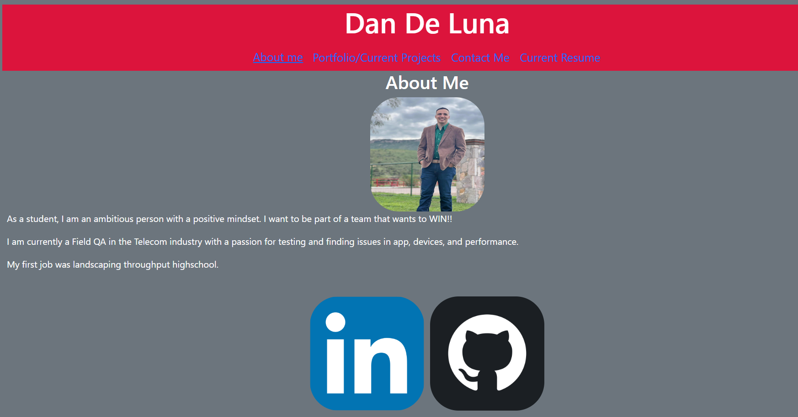
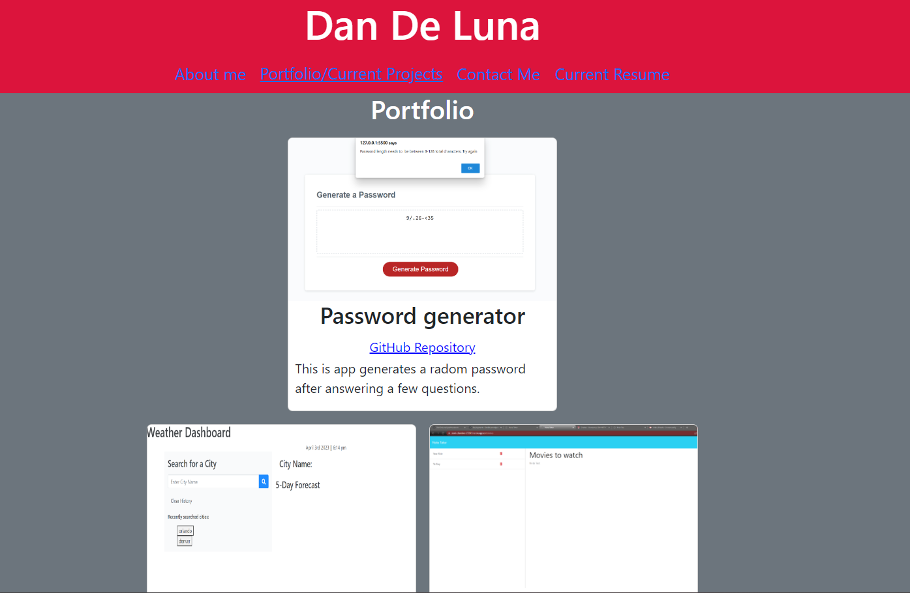
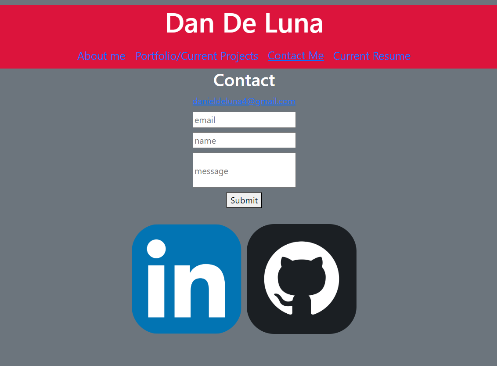
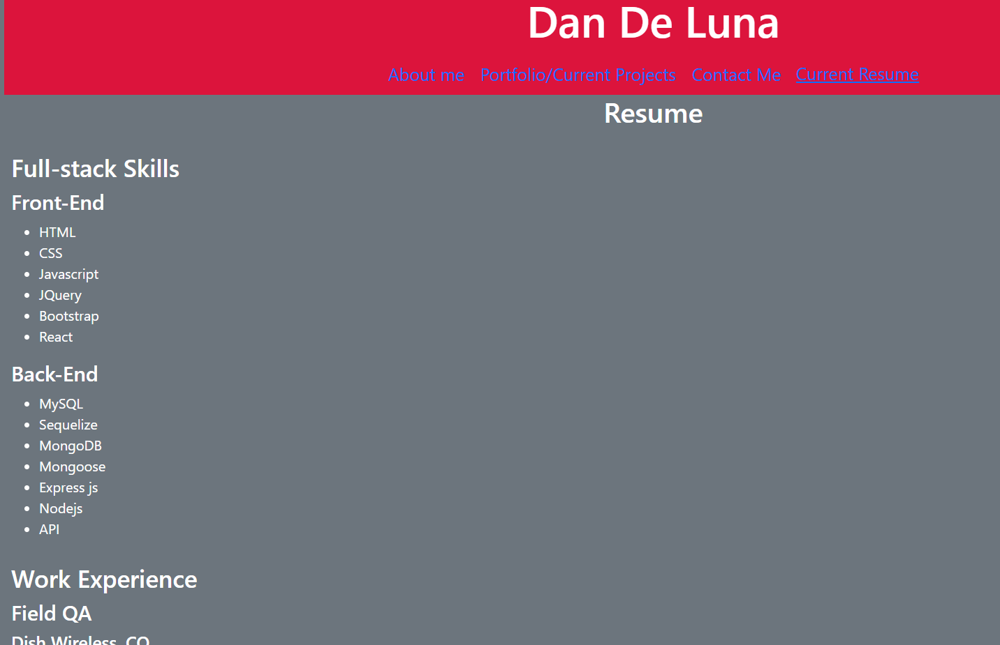

# Portfolio

## Licensing:

## Table of Contents 
- [User Story](#user-story)
- [Description](#description)
- [Installation](#installation)
- [Usage](#usage)
- [License](#license)
- [Contributing](#contributing)
- [Tests](#tests)
- [Questions](#questions)

## User Story:
AS A student looking for a job 

I WANT to build a React portfolio 

SO THAT I can display my skills

## Description:
This portfolio  shows information about me, some of my web apps,contact info, and resume.

## Installation
- Clone Repo
- Run npm i 

## Usage:

Webpage: https://dandeluna.github.io/react-Trial/

Screenshots of App:

Home & About Me

Portfolio

Contact Me

Resume

## License:
MIT
